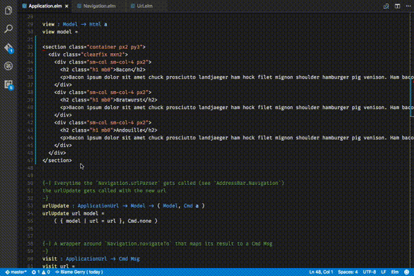

# HTML-to-Elm for Visual Studio Code

This extension adds support for converting HTML to Elm code. It uses the [htmlparser2](https://github.com/fb55/htmlparser2) to parse the HTML and construct Elm code.

## Install

Via Quick Open:

1. [Download](https://code.visualstudio.com/download), install and open VS Code
2. Press `cmd+p` to open the Quick Open dialog
3. Type `ext install html-to-elm`
4. Click the *Install* button, then the *Enable* button

Via the Extensions tab:

1. Click the extensions tab or press `cmd+shift+x`
2. Search for *html-to-elm*
3. Click the *Install* button, then the *Enable* button

Via the command line:

1. Open a command-line prompt
2. Run `code --install-extension Rubymaniac.vscode-html-to-elm`

## Usage

Well, the usage is pretty simple.

1. Select some text that is valid HTML code
2. `cmd+shift+p` to view the Command Palette
3. Type: `html convert to elm`
4. Select the command and hit return
5. Profit

In action:

## Contribute

For any bugs and feature requests please open an issue. For code contributions please create a pull request. Enjoy!

## Other

If you use Atom then check out [this](https://github.com/CodeTownOfficial/html-to-elm) plugin which I followed to create this VSCode extension.

## LICENSE

MIT License

Copyright (c) rubymaniac

Permission is hereby granted, free of charge, to any person obtaining a copy
of this software and associated documentation files (the "Software"), to deal
in the Software without restriction, including without limitation the rights
to use, copy, modify, merge, publish, distribute, sublicense, and/or sell
copies of the Software, and to permit persons to whom the Software is
furnished to do so, subject to the following conditions:

The above copyright notice and this permission notice shall be included in all
copies or substantial portions of the Software.

THE SOFTWARE IS PROVIDED "AS IS", WITHOUT WARRANTY OF ANY KIND, EXPRESS OR
IMPLIED, INCLUDING BUT NOT LIMITED TO THE WARRANTIES OF MERCHANTABILITY,
FITNESS FOR A PARTICULAR PURPOSE AND NONINFRINGEMENT. IN NO EVENT SHALL THE
AUTHORS OR COPYRIGHT HOLDERS BE LIABLE FOR ANY CLAIM, DAMAGES OR OTHER
LIABILITY, WHETHER IN AN ACTION OF CONTRACT, TORT OR OTHERWISE, ARISING FROM,
OUT OF OR IN CONNECTION WITH THE SOFTWARE OR THE USE OR OTHER DEALINGS IN THE
SOFTWARE.
